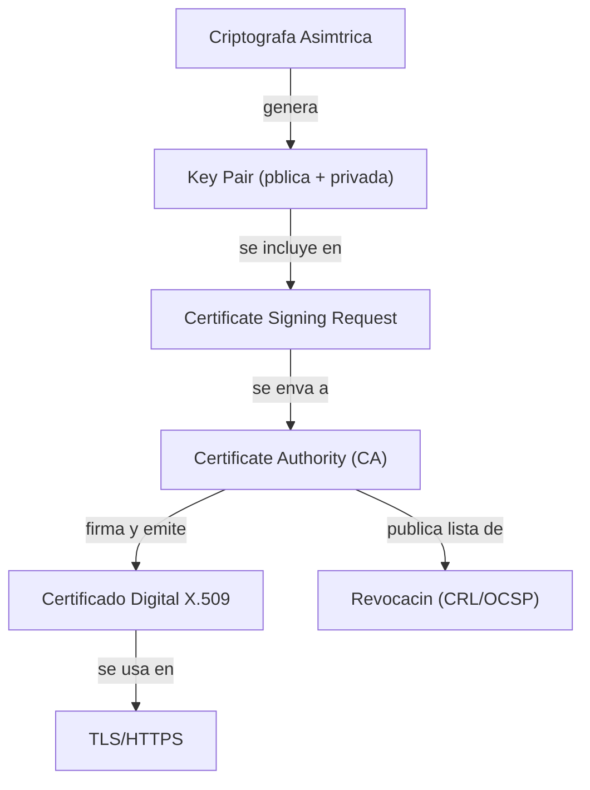
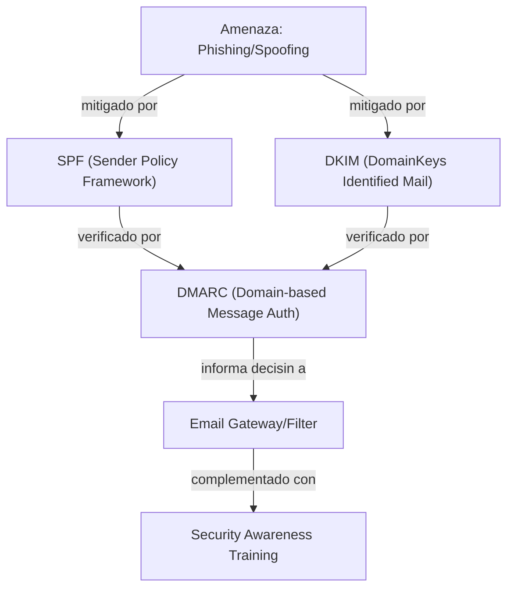
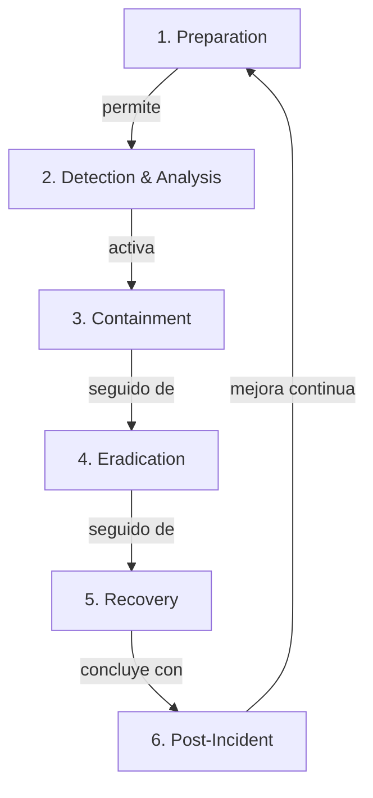
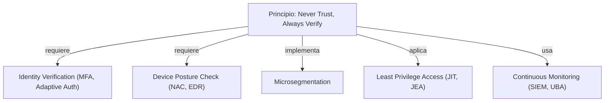
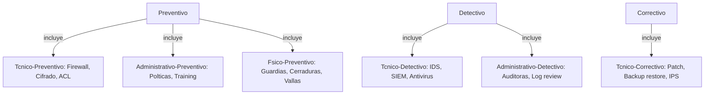

# Mapas Conceptuales Security+ SY0-701

Visualizar en: https://mermaid.live

---

## Criptografa y PKI End-to-End

Flujo completo desde generacin de claves hasta uso de certificados

---

## Email Security - Defensa en Capas

Cmo SPF, DKIM y DMARC trabajan juntos

**Notas:** SPF verifica IP del remitente. DKIM verifica firma digital. DMARC combina ambos y define poltica (reject/quarantine/none).

---

## Incident Response - Ciclo Completo

Fases del incident response segn NIST

---

## Zero Trust Architecture

Componentes y principios de Zero Trust

---

## Controles de Seguridad - Clasificacin Completa

Tipos de controles: tcnicos, administrativos, fsicos / preventivos, detectivos, correctivos

---

